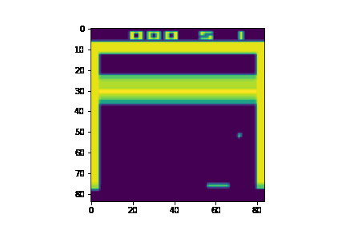

# Make GIF! 

given a file containing list of 3D/2D shapes, return a gif file. 




### mehtod 1 

use bash shell sciprt to produce a GIF

```
bash shell make_gif.sh <path-to-images> <store-name> <reshape> <interval>
```

* **path-to-image** : a path containing image numpy (N, W, H, C) / (N, W,H)
* **store-name** : gif store name
* **reshpe** : maps for reshaping. e.g., `210` means, `012` maps to `210` order. 
* **interval** : milisecond duration between two images (does not affect the file size. only speed.)


### method 2 

use python import to produce a GIF

```python
import numpy as np 
from deeping.visualize.make_gif import make_gif

states = np.random.ranndom(size=(100, 48,48,3))
make_gif(states, "results/name", [0,1,2], 50)
```